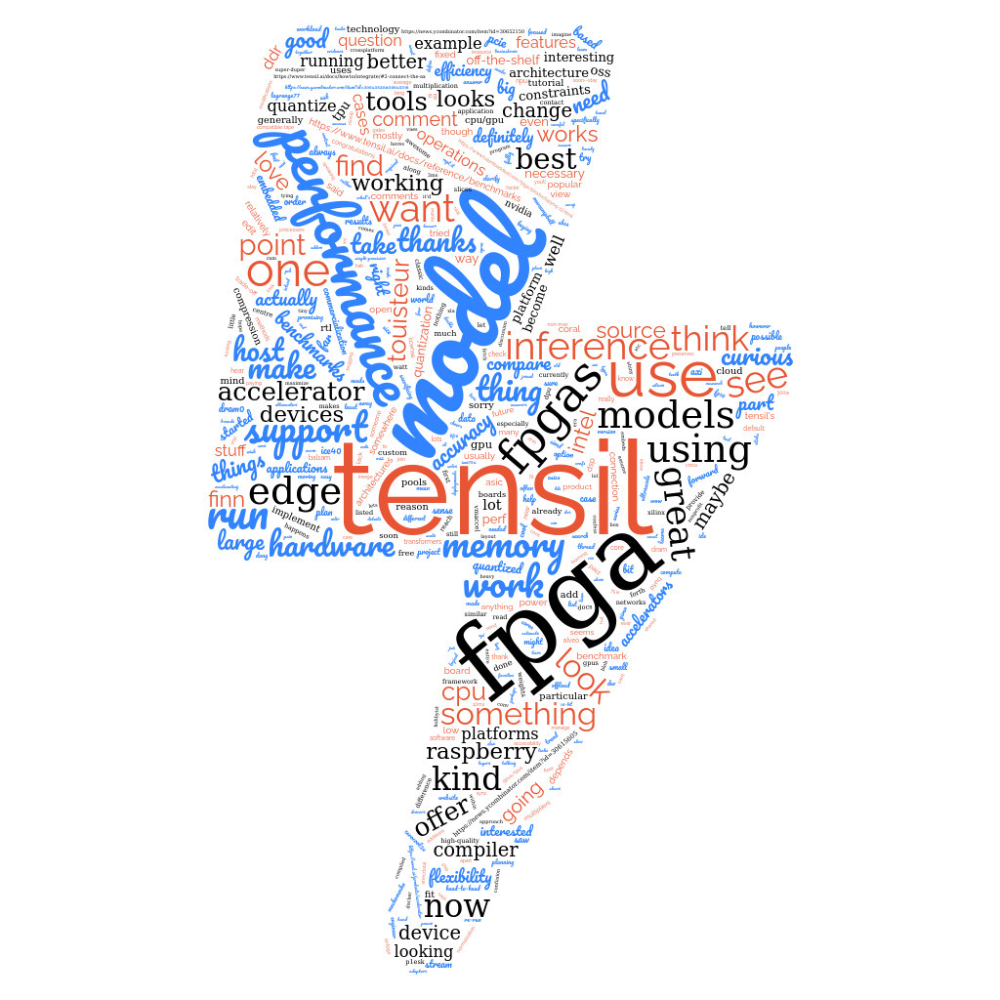

After our initial open source release, we published
a [Launch HN thread](https://news.ycombinator.com/item?id=30643520) to get some feedback from the community. We've pulled out a few of the many interesting questions and our responses with links to documentation for reference.

## Why not just use CPUs/GPUs?

- https://news.ycombinator.com/item?id=30654252

There are four big categories of ML accelerators. You are already familiar with CPUs and GPUs; then there are FPGAs, which offer better performance and efficiency while remaining flexible. Finally there are ASICs (of which the TPU is an example), which offer the best performance and efficiency but retain very little flexibility, meaning if your ML model doesn't work well on an ASIC then your only option is to change your model.

We chose to focus on FPGAs first because with them we can maximize the usefulness of Tensil's flexibility. For example, if you want to change your Tensil architecture, you just re-run the tools and reprogram the FPGA. This wouldn't be possible with an ASIC. That said, we'll be looking for opportunities to offer an ASIC version of our flow so that we can bring that option online for more users. 

FPGAs are pretty amazing devices, but one thing that's been holding them back is how difficult they have been to work with. Typically to actually make use of an FPGA you'd need to have an FPGA expert and an embedded software engineer on your team, along with all the requisite tools and materials. Our focus is on changing that dynamic, to help get your ML model running on an edge FPGA in minutes.

## Which FPGAs are supported?

- https://news.ycombinator.com/item?id=30618449

Generally speaking, FPGAs with some kind of DSP (digital signal processing) capability will work best, since they can most efficiently implement the multiply-accumulate operations needed.

Here are some examples in the benchmarks section of our docs: https://www.tensil.ai/docs/reference/benchmarks/

So far we've been focused on edge devices like the Zynq, Artix and Zynq Ultrascale+ families. Tensil certainly works on larger devices but it's not as optimized there as we'd like it. If that's interesting to you, I'd love to talk and understand your use case in more depth.

The Intel FPGA side is interesting, as you say there are fewer projects targeting their technologies for ML use cases. We haven't tested support for their boards yet, but there is nothing in our generated RTL that is exclusive to Xilinx. The only thing we'd need to add is new drivers for their platforms. 

We haven't specifically tested on any ICE40 FPGAs yet - if this is something that you'd really like to see, let me know! Taking a look at the lineup, the ICE40 LP8K and LP4K would be suitable for running a very small version of the Tensil accelerator. You'd want to run a small model in order to get reasonable performance.

## What model architectures are supported?

- https://news.ycombinator.com/item?id=30644969
- https://news.ycombinator.com/item?id=30645527

Currently we support convolutional neural networks. We're aiming to support all machine learning model architectures for inference and eventually training too. We're working on our roadmap right now and prioritizing support based on user interest. If there's a particular model or set of models you're interested in accelerating, we'd love to hear about it!

### Transformers

If there's a lot of interest in transformers, we'd aim to offer support in the next couple of months. We'll definitely add support for transformers in the near future, the question is only whether there are other things we should work on first, especially with respect to the edge and embedded domain where smaller conv models still dominate.

## What kind of performance can Tensil achieve?

- https://news.ycombinator.com/item?id=30646339
- https://news.ycombinator.com/item?id=30648928

The tricky thing about benchmarks is that one of the key benefits of Tensil is the flexibility to find a trade-off between performance, accuracy, cost and power usage that works for you. Benchmarks that only consider performance or performance per watt can be a bit narrow from that point of view. That said, you can find [our current benchmarks here]().

`bravura` asks:

> What sort of latency can you get on edge devices? Are there cases that processing can be done with 3ms or 10ms latency?

The answer is a resounding yes! Very small vision or audio tasks could be run at those speeds. The larger the model, the longer it will take to run in general.

`rowanG077` asks:

> Is performance model dependent?

Yes, and we provide tools to help you analyize various hardware configurations to find the best performance.

## What about quantization or model compression?

- https://news.ycombinator.com/item?id=30619963

For an edge deployment, you will usually need to quantize, prune or compress your ML model to get it working as fast as you'd like on a sufficiently small CPU/GPU. 

One thing that Tensil can do is help you avoid the need to quantize or compress your model entirely! For example, we've found that using a 16-bit fixed point numeric data type preserves almost all the model accuracy while not sacrificing performance thanks to the huge amount of parallelism available on FPGA.

Working with existing FPGA solutions like FINN from Xilinx usually requires big changes to your model in order to work, e.g. you are required to perform
quantizing down to 1 or 2 bit weights and manage the resulting loss of accuracy, which may require additional training.

Tensil works out of the box with any model. So no need to quantize / compress if you don't want to. You can also quantize and use Tensil too!

## How does Tensil compare with other options?

- https://news.ycombinator.com/item?id=30646763
- https://news.ycombinator.com/item?id=30646869
- https://news.ycombinator.com/item?id=30645318
- https://news.ycombinator.com/item?id=30622434
- https://news.ycombinator.com/item?id=30626240
- https://news.ycombinator.com/item?id=30646443
- https://news.ycombinator.com/item?id=30622283
- https://news.ycombinator.com/item?id=30654274
- https://news.ycombinator.com/item?id=30617638

### Xilinx DPU/FINN

If you're really familiar with the Xilinx ecosystem, one way we've described Tensil is that it is the "Microblaze for ML" - easy to use, lots of flexibility and customizability, with performance good enough for most applications. The DPU and FINN would then be the more specialized tool for situations where you need specific features they are optimized for.

### Google Coral

Coral is a great project, especially if you are using a completely vanilla off-the-shelf model. However if you've ever tried compiling a custom ML model for it, you know how finicky it can be. There are lots of ways that you can accidentally make it impossible for Coral to run your model, and it can be difficult to figure out what went wrong.

With Tensil, you circumvent that problem by changing the hardware to make it work for your model. If you have made modifications to an off-the-shelf model or have trained your own one from scratch, it might be a better option from the point of view of ease-of-use and even performance. 

### Hailo / other fixed ASICs

Generally the comparison between Tensil and any fixed ASIC is going to run along similar lines, which we explain in this comment regarding the Coral accelerator: https://news.ycombinator.com/item?id=30643520#30645318

The big difference is that while those fixed ASICs offer great performance on the set of models they were optimized for, there can be big limitations on their ability to implement other more custom models efficiently. Tensil offers the flexibility to solve that problem. 

### CPU/GPU

The general answer is that it depends on your model and on which FPGA platform we're talking about, but in a head-to-head benchmark test you'll find results in the ballpark of 2-10x CPU and 1-2x GPU. As you point out, the power and cost are big differentiators. The other thing to consider is (as another commenter mentioned) that usually inference on CPU or GPU will require you to do some model quantization or compression, which can degrade model accuracy. Tensil can give you a way around that dilemma, so that you can have great performance without sacrificing accuracy.

### Apache TVM / OctoML

TVM / OctoML are a great option if you have an off-the-shelf ML model and off-the-shelf hardware. Tensil is different in that you can actually customize the accelerator hardware itself, allowing you to get the best trade-off of performance / accuracy / power usage / cost given your particular ML workload. This is especially useful if you want to avoid degrading the accuracy of your models (e.g. through quantization) to achieve performance targets.

## Can you connect Tensil to a Raspberry Pi?

- https://news.ycombinator.com/item?id=30645751

This is a great idea, we're looking at boards that could be used in combination with a Raspberry Pi. The reason we haven't investigated this so far is that most of the dev boards we've tested with have an ARM core embedded in the FPGA fabric, so the additional CPU the Raspberry Pi would provide wasn't necessary.

`diptanu` comments:

> Looks like pynq-z2 has header pins which connect with raspberry pi. https://www.tulembedded.com/FPGA/ProductsPYNQ-Z2.html

And Tensil works with the Pynq-Z2!

## Does Tensil work with Pytorch?

- https://news.ycombinator.com/item?id=30650010

Yes! Just use the [built-in Pytorch ONNX functions](https://pytorch.org/docs/stable/onnx.html) to output your model as an ONNX file, then run it through Tensil.

`maille` asks:

> Apart from the discontinued Intel sticks, are there pytorch compatible USB accelerators on the market?

I'm not completely sure if the answer is no but I have had difficulty finding anything like that outside of Tensil.

## How does Tensil work?

- https://news.ycombinator.com/item?id=30657813
- https://news.ycombinator.com/item?id=30645156

With Tensil, all computations are performed on the FPGA. In addition to matrix multiplication Tensil supports SIMD instruction with various operations. The ML activations, average and maximum pooling, normalization, and image resizing use SIMD instruction. Some ML operations, such as padding, are achieved by changing the memory layout. Tensil uses DRAM0 and DRAM1 memory pools (usually in DDR memory) to interact with the host to read model inputs and weights and write outputs. It also uses these pools to offload intermediate results between layers and between tiles within a layer when FPGA does not have sufficient BRAM, which is common on lower-end devices. Tensil compiler takes care of finding the most efficient memory scheduling for given on-FPGA memory size.

## How will Tensil make money?

- https://news.ycombinator.com/item?id=30654382
- https://news.ycombinator.com/item?id=30650419

The core technology will always be free and open source, so to commercialize Tensil we're planning to offer a "pro" version which would operate under a paid license and provide features specifically needed by enterprise users. We're also working on a web service that will let you run Tensil's tools in a hosted fashion, with one major feature being the ability to search across a large number of potential architectures to find the best FPGA for your needs. Extra paid support and other services like ASIC tape-outs will also be in the mix. 

